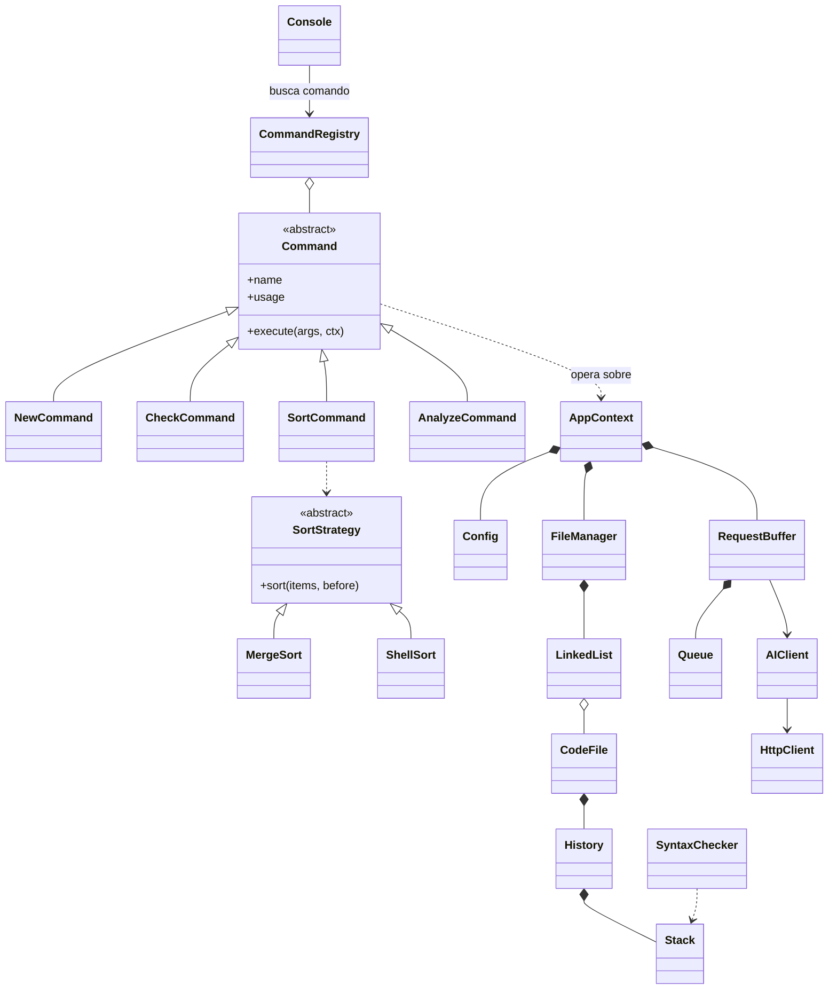

# Synthetix Studio

Mini IDE por línea de comandos en Python, construido sobre el patrón **Command**, con estructuras
de datos y algoritmos de ordenamiento implementados desde cero, configuración externa y análisis
de código asistido por IA.

Proyecto 1 — Algoritmos y Estructuras II — Universidad José Antonio Páez — Septiembre 2026.

| Integrante | Módulo | Rama |
|---|---|---|
| Angel Torres | Archivos, configuración, análisis estático | `feature/archivos` |
| Luis Orellana | Validación, historial, ordenamiento | `feature/validacion-ordenamiento` |
| Alfredo Aureliano | Cola de peticiones, integración con IA | `feature/cola-ia` |

## Requisitos
Python 3.10 o superior. No usa librerías externas (no hace falta `pip install`).

## Ejecución
```bash
python main.py config.json
```
Al iniciar, el programa lee **obligatoriamente** el archivo de configuración (por defecto
`config.json`). Si no puede leerlo, termina con un mensaje de error.

Para usar la IA, antes de ejecutar defina la clave en una variable de entorno:
```bash
# Windows (PowerShell)
$env:SYNTHETIX_API_KEY="tu_clave"
# Linux / macOS
export SYNTHETIX_API_KEY="tu_clave"
```

## Verificación
```bash
python scripts/verificar.py              # estado del proyecto por integrante
python scripts/verificar.py --estricto   # entrega: todo implementado y en verde
python scripts/verificar.py --probar-ia  # incluye una llamada real a la IA
```
Revisa configuración, conexión entre módulos, estructuras prohibidas, la prueba de humo
(`tests/smoke.txt`, que recorre todos los comandos) y las pruebas unitarias de cada integrante
(`tests/test_angel.py`, `tests/test_luis.py`, `tests/test_alfredo.py`). GitHub Actions la corre en
cada push y en cada Pull Request.

## Configuración (`config.json`)
| Clave | Uso |
|---|---|
| `paths.backups` | Carpeta de respaldos automáticos (`save`, `delete` y al salir) |
| `paths.logs` | Carpeta del log de errores (`synthetix.log`) |
| `api.base_url` + `api.endpoint` | URL del modelo de IA (formato OpenAI-compatible) |
| `api.model` | Modelo a usar |
| `api.api_key_env` | Nombre de la variable de entorno con la clave (la clave nunca va en el repo) |
| `api.timeout_seconds` | Tiempo máximo por petición |
| `editor.max_line_length`, `editor.max_function_lines` | Límites del análisis estático |

Proveedores compatibles cambiando solo `base_url` y `model`: Groq, Gemini (endpoint
OpenAI-compatible), OpenRouter, OpenAI. Verificar en la documentación del proveedor el nombre
vigente del modelo.

## Comandos
| Módulo | Comando | Descripción |
|---|---|---|
| Archivos y configuración | `new <nombre> [contenido]` | Crea un archivo en memoria y lo activa |
| | `list` | Lista los archivos abiertos con su posición y estado |
| | `switch <id/nombre>` | Cambia el archivo activo |
| | `delete <id/nombre>` | Elimina un archivo y libera sus nodos |
| | `config <ruta>` | Carga otro archivo de configuración |
| | `show` | Muestra el código activo con números de línea |
| | `write` | Reescribe el archivo activo (terminar con una línea `.`) |
| | `append <texto>` / `insert <n> <texto>` / `replace <n> <texto>` / `remove <n>` | Edición por líneas |
| | `load <ruta>` / `save` | Abrir desde disco / guardar respaldo |
| Validación e historial | `check` | Valida el balanceo de `()`, `{}`, `[]` e indica línea y carácter |
| | `undo` / `redo` | Deshace / rehace usando dos pilas |
| | `history` | Tamaño de las pilas Undo/Redo |
| Ordenamiento | `lint` | Diagnósticos del análisis estático |
| | `sort <line\|severity> <mergesort\|shellsort> [asc\|desc]` | Ordena los diagnósticos |
| Buffer de peticiones | `queue-status` | Estado de la cola FIFO hacia la IA |
| Integración IA | `analyze` | Encola el código activo para análisis Big O y refactorización |
| | `results` | Muestra las respuestas recibidas |
| General | `help`, `exit` | Ayuda / salir |

## Ejemplos de uso
Sesiones reales copiadas de la consola. El indicador `synthetix(<archivo>)>` muestra el
archivo activo.

**Configuración** — el programa ya la leyó al iniciar; `config` permite recargarla y
muestra lo que se usará:
```text
synthetix> config config.json
Configuración cargada desde config.json
  Respaldos: ./backups
  Logs:      ./logs
  API:       https://api.groq.com/openai/v1/chat/completions (modelo llama-3.3-70b-versatile)
  Clave API: NO encontrada en la variable de entorno
```

**Archivos en la lista enlazada** — crear (con contenido inicial opcional, `\n` separa
líneas), listar, cambiar el activo y eliminar:
```text
synthetix> new main.py
Archivo creado: [1] main.py (ahora es el activo)
synthetix(main.py)> new util.py "def doble(x):\n    return x * 2"
Archivo creado: [2] util.py (ahora es el activo)
synthetix(util.py)> list
Archivos abiertos (2):
    1. [id 1] main.py  - 1 líneas
  * 2. [id 2] util.py  - 2 líneas  (activo)
synthetix(util.py)> switch main.py
Archivo activo: main.py
synthetix(main.py)> delete util.py
Archivo eliminado: util.py
synthetix(main.py)> switch 9
[error] No existe el archivo '9'
```
`switch` y `delete` aceptan el id (`switch 1`) o el nombre (`switch main.py`).

**Análisis estático** — `write` reemplaza el contenido (se termina con una línea `.`) y
`lint` muestra los diagnósticos en orden de aparición:
```text
synthetix(main.py)> write
Escribe el nuevo contenido de main.py. Termina con una línea que solo tenga '.'
from os import *

def procesar(datos):   
    for d in datos:
        if d:
            while d:
                if d > 1:
                    d -= 1
                    print(d)
    # TODO: revisar
    return datos
.
synthetix(main.py)> lint
LÍNEA  GRAVEDAD  REGLA                   MENSAJE
1      WARNING   wildcard-import         Importación con '*': importa solo lo que uses
3      INFO      function-lines          La función procesar tiene 9 líneas
3      INFO      trailing-whitespace     Espacios en blanco al final de la línea
8      WARNING   deep-nesting            Bloque con 5 niveles de indentación (máximo 4)
10     INFO      todo-comment            Comentario pendiente: # TODO: revisar
5 diagnósticos en main.py
```
Esos mismos diagnósticos son los que ordena `sort line mergesort` o
`sort severity shellsort desc`.

**Salida con respaldo automático** — los archivos modificados sin guardar se respaldan en la
carpeta `paths.backups`:
```text
synthetix(main.py)> exit
Cerrando Synthetix Studio...
Respaldo automático: ./backups\main.py_20260930_000625.bak
```

## Arquitectura



- **Command**: `Console` (Invoker) lee la línea, `CommandRegistry` encuentra el comando y este
  actúa sobre los receptores del `AppContext`. Agregar un comando no requiere tocar la consola.
- **Memento**: cada `CodeFile` tiene un `History` con dos pilas de estados (Undo/Redo).
- **Strategy + Factory**: el algoritmo de ordenamiento se elige en tiempo de ejecución.
- **Productor–consumidor**: `analyze` encola; un único hilo despacha las peticiones en orden FIFO.

Diseño detallado y justificación de complejidad: [`docs/INFORME_TECNICO.md`](docs/INFORME_TECNICO.md).

## Restricciones del enunciado
No se usan estructuras ni ordenamientos predefinidos: listas enlazadas, pilas y colas propias con
nodos, y MergeSort / ShellSort escritos a mano. `scripts/check_prohibidos.py` lo verifica en cada push.

## Flujo de trabajo
Ramas `feature/<modulo>` → Pull Request a `main` con revisión de otro integrante.
Commits con Conventional Commits (`feat(pila): ...`, `fix(cola): ...`). Detalle en
[`docs/TAREAS.md`](docs/TAREAS.md).
